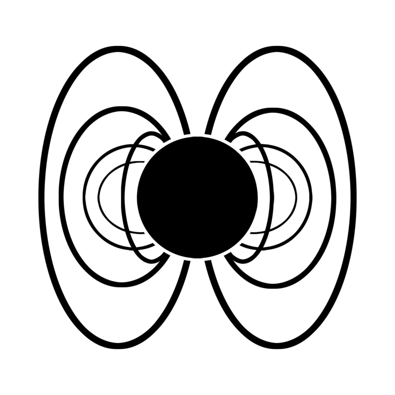
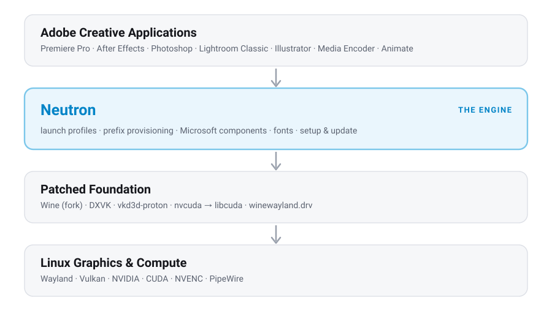
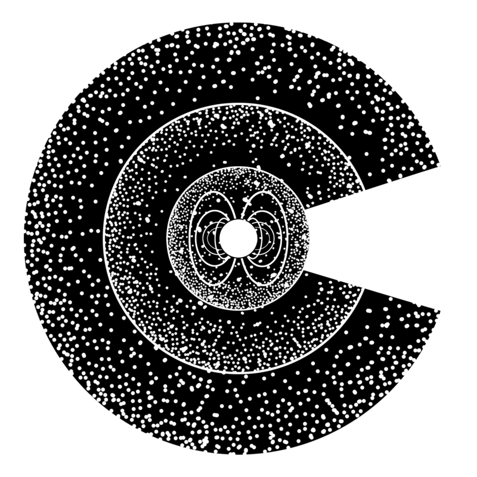

<div align="center">

<picture>
  <source media="(prefers-color-scheme: dark)" srcset="assets/neutron-logo-dark.png">
  <source media="(prefers-color-scheme: light)" srcset="assets/neutron-logo-light.png">
  
</picture>

# Neutron

**A Wine-based compatibility engine tuned for professional creative software on Linux.**

Premiere Pro · After Effects · Photoshop · Lightroom · Illustrator · Animate · Media Encoder
— accelerated on your GPU, running on Linux.

<br>


</div>

---

> [!WARNING]
> **Neutron is in experimental alpha.** Everything here is early, in-progress research on a
> single development machine — an NVIDIA RTX 5070 (nvidia-open) on CachyOS with KDE Wayland.
> Nothing below is validated across hardware, distributions, or application versions. Things
> break, and you must bring your own legally licensed Adobe software. Treat this as a look at
> where the project is headed, not a finished product.

---

## What is Neutron?

Linux is already a first-class platform for gaming, development, and infrastructure — but
professional content creators are still tethered to Windows and macOS by the deep OS
dependencies of industry-standard creative tools.

**Neutron aims to close that gap.** Just as Valve's Proton tailored Wine to make Windows games
run near-natively on Linux, Neutron forks and tunes Wine specifically for the demands of
professional creative software: high-throughput media pipelines, GPU compute, color management,
licensing daemons, and the tangle of inter-process communication these suites rely on.

The goal is simple to state and hard to reach: make Linux a rock-solid daily driver for
multimedia professionals.

Neutron is the **engine**. It is designed to be driven directly from its command line, or through
[**Collider**](#collider--the-companion-launcher), a graphical launcher and prefix manager built
on top of it.

---

## Architecture

Neutron sits between your creative applications and the Linux graphics stack, coordinating a
patched Wine foundation and shipping the fixes those applications need to run.

<div align="center">

<picture>
  <source media="(prefers-color-scheme: dark)" srcset="assets/architecture-dark.svg">
  <source media="(prefers-color-scheme: light)" srcset="assets/architecture-light.svg">
  
</picture>

</div>

---

## Compatibility

> [!NOTE]
> These are **early results from active development**, observed on one machine. Every entry has
> rough edges. "Alpha" means it boots and does real work in testing — not that it is stable or
> complete.

| Application / Feature | Status | Notes |
| :--- | :--- | :--- |
| **Premiere Pro 2025** | 🟢 `Alpha` | GPU/Mercury rendering, timeline playback, and hardware **NVENC** export that muxes natively into a valid MP4. Frame pacing and third-party plugins are still rough. |
| **After Effects 2025** | 🟢 `Alpha` | Workspace, dialogs, and **composition rendering** (Wine's Direct2D was missing the un-premultiply effect AE treats as fatal). Rulers/guides overlay is disabled pending CUDA↔D3D11 interop. |
| **Photoshop 2025** | 🟢 `Alpha` | Boots to the home screen; full workspace docks on **File → New**; GPU canvas drawing (~56 fps in testing). Some warm-up lag remains. |
| **Lightroom Classic** | 🟢 `Alpha` | Imports 1000+ RAW files, SD-card hotplug, masking, AI Denoise, Edit-in-Photoshop. UI load-in is slow. |
| **Illustrator 2025** | 🟢 `Alpha` | Artboard, panels and toolbars render correctly (a whole-window shear traced to `CreateBitmapIndirect` discarding the caller's stride). |
| **Media Encoder 2025** | 🟢 `Alpha` | Queue, render and export end-to-end, including native muxing. |
| **Animate 2024** | 🟢 `Alpha` | Canvas, panels and playback. Its home screen is blank — that is Adobe's own bug, blank on Windows too; File → New works. |
| **Dynamic Link** (Premiere ↔ After Effects) | 🟢 `Alpha` | Full round trip, no engine changes required — both applications must be running. |
| **CEP / UXP panels** | 🟢 `Alpha` | Third-party panels render and stay interactive inside their docks. |
| **Pen / tablet input** | 🟢 `Alpha` | Pressure, tilt and eraser via WinTab. The first stroke after a tool switch can stray. |
| **Drag and drop from the file manager** | 🟢 `Alpha` | Dropping files from Dolphin/Nautilus into an application. |
| **NVIDIA (CUDA / NVENC)** | 🟢 `Alpha` | The primary hardware used in development (RTX 5070, nvidia-open). |
| **AMD / Intel GPUs** | ⚪ `Untested` | Non-NVIDIA compute/present paths have not been validated. NVENC in particular is NVIDIA-only. |
| **Third-party plugins** | ⚪ `Untested` | Core application stability comes first. |

### Creative Cloud 2026

Support is tracked **per release** — a fix landing on one version does not automatically carry to
the next. The table above is the 2025 line; 2026 is being brought up separately.

| Application | Status | Notes |
| :--- | :--- | :--- |
| **Premiere Pro 2026** | 🟢 `Beta` | Installed from an offline package and verified launching and running on the 2026 stack, inheriting the 2025 fixes with no new engine work. Not yet used for a paid job on this release. |
| **Photoshop 2026** | 🟢 `Beta` | Stable for day-to-day work on this release. |

Everything else in the 2026 line is untested. The
[status board](https://neutronproject.org) tracks both releases and is the canonical view.

> [!NOTE]
> Even where a specific app is untested, the core fixes built for the apps above — licensing and
> daemon isolation, GPU/compute mapping, font rendering, IPC, and native display/present paths —
> lay the groundwork for the rest of the Creative Cloud ecosystem.

---

## What Neutron actually does

Under the hood, Neutron is a set of targeted fixes and a runtime that assembles them. The main
focus areas:

- **🎨 Native display & present paths** — routing each application's on-screen surfaces through a
  path that actually works under Wine, so panels, canvases, and monitors render on the GPU.
- **⚡ GPU & compute mapping** — translating Windows compute APIs (D3D11/12, CUDA) into native
  Vulkan and `libcuda` for real-time effects, rendering, and export.
- **🔐 Licensing & daemon isolation** — keeping Adobe's background authentication and licensing
  services running without dropping sessions.
- **🔊 Low-latency audio** — routing through modern Linux audio (PipeWire) to avoid sync drift on
  heavy timelines.
- **🔗 Inter-process communication** — the structural foundation for interoperability between
  suite applications (dynamic asset linking, panels, brokers).
- **📦 Hardware export** — NVENC output muxed natively into valid deliverables. (This began as an
  external finalize daemon; it was retired once the underlying fault — Microsoft's UCRT rejecting
  Wine's `\\?\` temp paths, which made the muxer skip interleaving — was fixed properly.)

The shipping fixes live in [`patches/production/`](patches/), the reusable runtime bundle in
`runtime/`, and the full engineering story in [`docs/`](docs/) and [`STATE.md`](STATE.md).

---

## Getting Started

> [!IMPORTANT]
> This is a developer preview, not a one-click installer yet. You will need a patched Neutron
> Wine build and your own installed, licensed Adobe application. The hardening pass tracked in
> [`docs/neutron_hardening_brief.md`](docs/neutron_hardening_brief.md) is turning this into a
> reproducible build.

**Prerequisites**

- Linux with an **NVIDIA GPU** (dev/test: RTX 5070 / nvidia-open, CachyOS + KDE Wayland). Other
  GPUs are untested.
- A **patched Neutron stack** — forked Wine (wine-tkg / staging base) plus patched DXVK,
  vkd3d-proton, and the nvcuda wrapper. See [`STATE.md`](STATE.md) for the component list and
  per-component build steps.
- **Python 3**, plus `inotify-tools` and `ffmpeg` for hardware export.
- Your own **legally licensed Adobe application**, installed into a Wine prefix.

**Run it**

```bash
git clone https://github.com/Nico-LaFoucate/Neutron.git
cd Neutron

# Point at your Wine prefix — use any path you like, then reuse it below.
# (prefix provision takes the path as a positional argument.)
./bin/neutron prefix provision ~/neutronprefix

# Sanity-check the stack
./bin/neutron doctor --prefix ~/neutronprefix

# See which apps are installed in the prefix
./bin/neutron apps --prefix ~/neutronprefix

# Launch through the Neutron stack
./bin/neutron launch premiere --prefix ~/neutronprefix
```

Add `bin/` to your `PATH` (or symlink `bin/neutron` into `~/.local/bin`) to call `neutron`
from anywhere.

### The `neutron` CLI

`neutron` is the engine's front door — the same interface Collider drives. Add `--json` to any
command for structured output.

| Command | What it does |
| :--- | :--- |
| `neutron launch <app> [file]` | Launch an app through the Neutron stack. Apps: `premiere`, `photoshop`, `lightroom`, `aftereffects`, `illustrator`, `animate`, `mediaencoder`. Supports `--prefix`, `--gpu`, `--scale`, and opening a project file. |
| `neutron prefix provision <path>` | Make a staged Wine prefix Neutron-ready (fonts, overrides, display fixes). |
| `neutron prefix info <path>` | Report the paths and state Collider needs. |
| `neutron apps --prefix <path>` | List apps and install status in a prefix. |
| `neutron doctor --prefix <path>` | Health-check the prefix and stack. |
| `neutron teardown [--app <id>]` | Close one app, or the whole prefix, cleanly — apps save their preferences, and Adobe's orphaned daemons are swept so they can't wedge the next launch. |
| `neutron runtime install` | Download, verify (sha256), and unpack the pinned [neutron-wine](https://github.com/Nico-LaFoucate/neutron-wine) runtime — the patched Wine the engine runs. |
| `neutron runtime capture` | Build the runtime DLL bundle from a proven prefix. |

---

## Collider — the companion launcher

<div align="center">

<picture>
  <source media="(prefers-color-scheme: dark)" srcset="assets/collider-neutron-dark.png">
  <source media="(prefers-color-scheme: light)" srcset="assets/collider-neutron-light.png">
  
</picture>

</div>

Neutron is the engine; **Collider** is the cockpit. It's a graphical launcher and prefix manager
built to sit on top of Neutron — one tinted tile per installed app, prefix provisioning, display
scaling, theming, and the hardware-export daemon, all without touching a terminal.

Collider lives in its **own repository** (public soon). Neutron is fully usable on its own via the
CLI above — Collider is the convenience layer for people who'd rather click than type.

---

## Repository layout

| Path | Contents |
| :--- | :--- |
| [`bin/neutron`](bin/) | The Neutron CLI — the engine front door. |
| [`patches/production/`](patches/) | The shipping fixes (anchor-guarded, idempotent). |
| [`runtime/`](runtime/) | The runtime DLL bundle and override maps. |
| [`scripts/`](scripts/) | Build, launch, and hardware-export helpers. |
| [`docs/`](docs/) | Architecture map, investigations, and open issues. |
| [`STATE.md`](STATE.md) | The known-working configuration and what each patch does. |

**Start here:** [`STATE.md`](STATE.md) for the working configuration, then
[`docs/display_architecture_map.md`](docs/display_architecture_map.md) for how display works, and
[`docs/OPEN_ISSUES.md`](docs/OPEN_ISSUES.md) for the current work.

---

## Contributing

Contributions are welcome — please open an issue to discuss approach before large PRs. A few
ground rules learned the hard way (full version in [`CONTRIBUTING.md`](CONTRIBUTING.md)):

- **Verify before patching.** Adobe binaries are stripped; instrument *our* side (Wine / DXVK /
  vkd3d), don't guess Adobe's logic.
- **Prefer correct fixes over workarounds.** A single supported preference beats a pile of blits.
- **Patch discipline:** exact anchors, abort on mismatch, back up, verify the marker landed in the
  built DLL, confirm a clean build.
- **Never commit a Wine prefix or build artifacts.**

---

## License

Neutron is a derivative work of Wine and is proudly open source, licensed under the
**GNU Lesser General Public License (LGPL), version 2.1 or later**. See [`LICENSE`](LICENSE) for
the full text.

---

## Disclaimer

Neutron is an independent, open-source compatibility tool. It is **not** affiliated with,
associated with, authorized by, endorsed by, or in any way officially connected to Adobe Inc. or
any of its subsidiaries. All product names, logos, and brands are property of their respective
owners. Users must provide their own legally acquired licenses and accounts to download and run
software within this compatibility layer.
